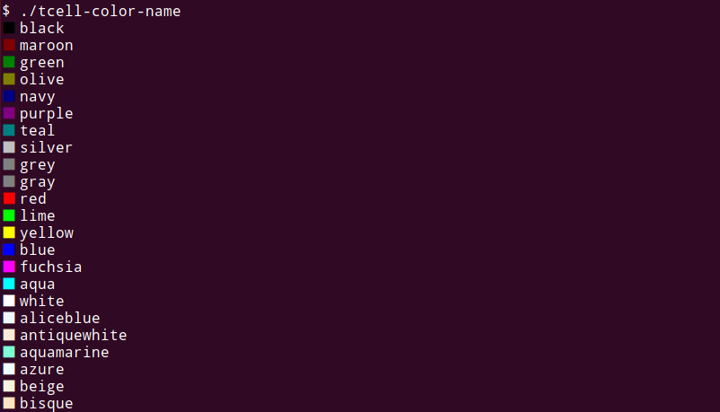

# tcell-color-name

Displays the [tcell](https://github.com/gdamore/tcell) color and color name on standard output.

Not TUI.



## Install

```console
go install github.com/noborus/tcell-color-name@latest
```